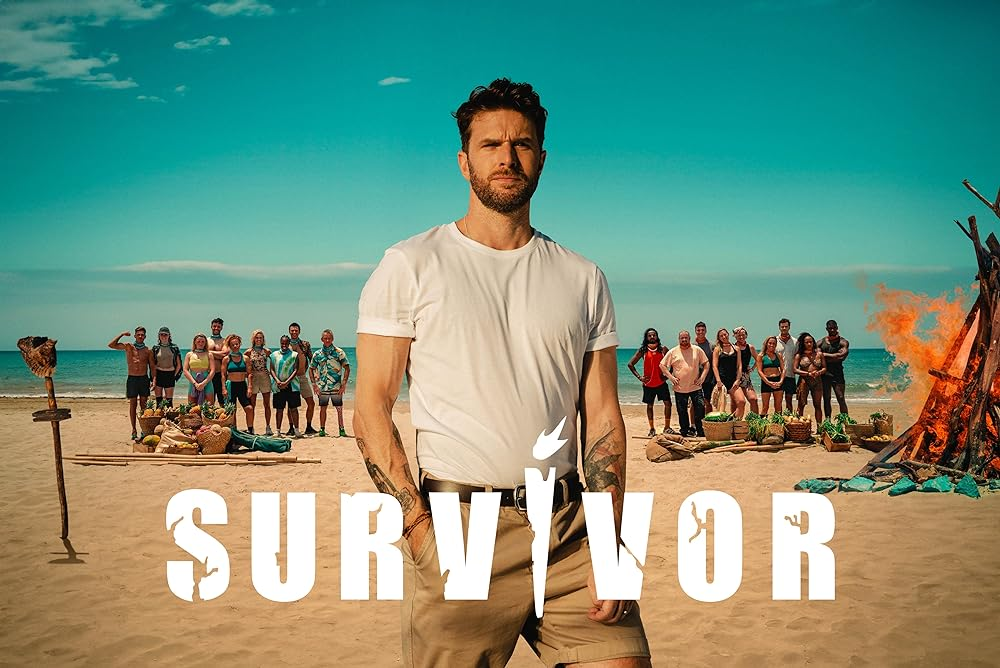

**Noah Xu**

## Intro

Survivor is a reality-competition television franchise produced in many countries around the world. The show features **a group of contestants deliberately marooned in an isolated location, where they must provide basic survival necessities for themselves**. The American version of Survivor has 43 seasons since its launch in 2000.